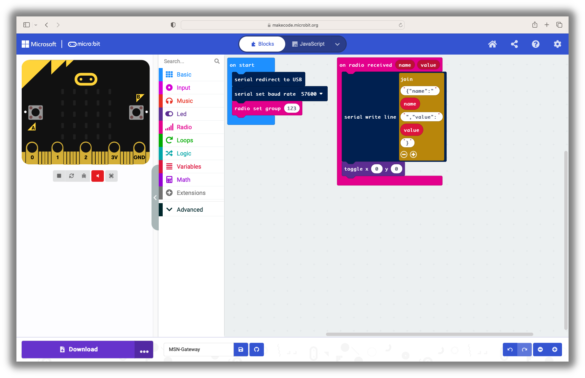
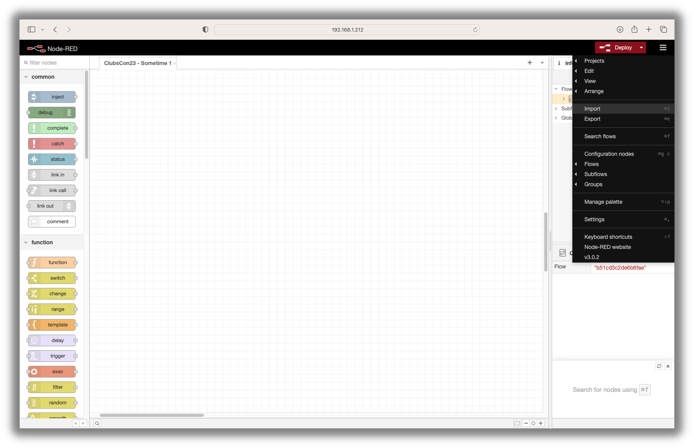

# ClubsCon23 - Sometimes 1 + 1 = 3

**Contents**

- [ClubsCon23 - Sometime 1 + 1 = 3](#clubscon23---sometimes-1--1--3 "ClubsCon23 - Sometime 1 + 1 = 3")
	- [Why?](#why "Why?")
- [The Setup](#the-setup "The Setup")
	- [Hardware Design](#hardware-design "Hardware Design")
	- [Software Stack](#software-stack "Software Stack")
		- [The Sensor Micro:bits](#the-sensor-microbits "The Sensor Micro:bits")
			- [Acceleration (X, Y & Z)](#1-acceleration-x-y--z "Acceleration")
			- [Compass](#2-compass "Compass")
		- [The Gateway Micro:bit](#the-gateway-microbit "The Gateway Micro:bit")
		- [Node-RED](#node-red "Node-RED")
			- [Issues](#issues "Issues")
				- [The *Gateway* Micro:bit is Showing as \"not connected\"](#the-gateway-microbit-is-showing-as-not-connected "The *Gateway* Micro:bit is Showing as \"not connected\"")
		- [Browser Based Graphs](#browser-based-graphs "Browser Based Graphs")
- [Everything Working?](#everything-working "Everything Working?")

Welcome to the content that is associated with my "Sometime 1 + 1 = 3, the power of connecting devices" presentation at the Raspberry Pi Foundations ClubsCon23 conference (24th & 25th March 2023). The presentation looked at connecting devices together to create something greater than the sum of all it's parts. My demonstration focused on a way to let children play and explore the idea of using Micro:bits as remote devices to capture and share their inputs in real time. These inputs are wirelessly displayed as charts and in real time using a Raspberry Pi and a browser.

## Why?
With physical computing, being able to play with an individual device and see what you can make it do is a fantastic experience but thats it, an individual device. In reality the world is made up of devices that are constantly talking to each other and the presentation showed a way that allows children to code a device that is part of something bigger. For children this can be a real eye opener to a whole new world of possibilities. Showing what is possible will only start a whole new line of "what if" and "could I" discussions.

I could have used some off the shelf solutions but they all come at a cost in comparison to the Micro:bit. Also this way children will get more hands-on experiences constructing a sensor and then coding the sending of information. 

# The Setup

## Hardware Design

I wanted to keep the hardware as simple and understandable as possible. With this setup it's possible to physically talk through how everything is connected together. How multiple *sensor* Micro:bits can talk to a *gateway* Micro:bit which in turn talks to a Raspberry Pi. This in turn then displays all the information received.

## Software Stack

Again hopefully a simple approach to the software used. The *sensor* Micro:bits just contain simple blocks to set up the wireless connection and then send information on a regular basis. The *gateway* Micro:bit is only concerned with taking all information received over the wireless connection and forward it over the serial connection to the Raspberry Pi. On the Raspberry Pi Node-RED takes the incoming serial connection and after a small bit of processing, forwards the information received to Node-Red-Dashboard nodes that can produce browser based real-time graphs.

### The *Sensor* Micro:bits
This GitHub repository contains two example sensors. Each of them uses the Micro:bits own internal inputs and then sends the information at different rates. The information is sent as a name and value. This method limits the length of the names being sent to a maximum of 8 characters and the associated value can only be numeric. The examples use Radio Group 123 but if you do change this remember to change the Radio Group used by the *gateway* Micro:bit to match. The inclusion of the toggle block is only there to provide a visual indicator that information is being sent. After examining the two example sensor .hex files it should be easy to create your own sensors using more complex scenarios and / or external sensors. 

**REMEMBER .hex FILES CAN BE IMPORTED TO THE MAKECODE BLOCK EDITOR**

#### 1. Acceleration (X, Y & Z)

After initialising the Radio Group to 123, the acceleration strength value, a combination of the X, Y & Z values, is sent 10 times a second (every 100ms). Download the [ClubsCon23-Acceleration-X.hex](https://raw.githubusercontent.com/RBilsland/ClubsCon23-Sometimes-1-1-3/main/Microbit/ClubsCon23-Acceleration-X.hex "ClubsCon23-Acceleration-X.hex"), [ClubsCon23-Acceleration-Y.hex](https://raw.githubusercontent.com/RBilsland/ClubsCon23-Sometimes-1-1-3/main/Microbit/ClubsCon23-Acceleration-Y.hex "ClubsCon23-Acceleration-Y.hex"), [ClubsCon23-Acceleration-Z.hex](https://raw.githubusercontent.com/RBilsland/ClubsCon23-Sometimes-1-1-3/main/Microbit//main/Microbit/ClubsCon23-Acceleration-Z.hex "ClubsCon23-Acceleration-Z.hex") .hex files ready to be loaded onto separate Micro:bits.

#### 2. Compass

After initialising the Radio Group to 123, the compass heading is sent 2 times a second (every 500ms). This sensor also includes blocks for it to be used with [Kitronik's ZIP Halo HD accessory](https://kitronik.co.uk/products/5672-kitronik-zip-halo-hd-for-microbit). If you want to remove this functionality then delete set haloDisplay block in on start section and the first three blocks (haloDisplay clear, set and show) in the every section. Download the [ClubsCon23-Compass.hex](https://raw.githubusercontent.com/RBilsland/ClubsCon23-Sometimes-1-1-3/main/Microbit/ClubsCon23-Compass.hex "ClubsCon23-Compass.hex") .hex file ready to be loaded onto a Micro:bit.

### The *Gateway* Micro:bit
This Micro:bit has only a single task to perform, receive all incoming information from one or many Micro:bits and forward it onto Node-RED on the Raspberry Pi. If you have decided to change the Radio Group used on the *sensor* Micro:bits then remember to change the Radio Group here to match. Again the inclusion of the toggle block is only there to provide a visual indicator that information is being forwarded. As long as information is sent in the same format from the *sensor* Micro:bits then this will not need to be changed.
 

After redirecting the serial connection to be over USB, setting the serial baud rate (the speed at which the information is sent) and initialising the Radio Group to 123, every time information is received it is reformatted to a simple JSON string that Node-RED on the Raspberry Pi can easily read. Download the [ClubsCon23-Gateway.hex](https://raw.githubusercontent.com/RBilsland/ClubsCon23-Sometimes-1-1-3/main/Microbit/main/Microbit/ClubsCon23-Gateway.hex "ClubsCon23-Gateway.hex") .hex file ready to be loaded onto a Micro:bit.

### Node-RED
Whether Node-RED is or isn't already installed on your Raspberry Pi doesn't matter as the script they provided can perform both installs and updates. Even if you believe you have Node-RED setup on your Raspberry Pi it could still be worth checking as recently they have released version 3. If you have any issues installing or updating you can find further help at Node-REDs [Running on Raspberry Pi](https://nodered.org/docs/getting-started/raspberrypi "Running on Raspberry Pi") guide.

As the Node-RED interface is viewed in a browser the following command can either be run through an SSH connection to your Raspberry Pi or through a terminal window from the desktop:

	bash <(curl -sL https://raw.githubusercontent.com/node-red/linux-installers/master/deb/update-nodejs-and-nodered)
	
Once the script has run successfully you will have the latest version of Node-RED installed and as part of the process the following commands have been installed to help manage running Node-RED.

- `node-red-start` - this starts the Node-RED service and displays its log output. Pressing Ctrl-C or closing the window does not stop the service; it keeps running in the background.
- `node-red-stop` - this stops the Node-RED service.
- `node-red-restart` - this stops and restarts the Node-RED service.
- `node-red-log` - this displays the log output of the service.

It's quite often useful to have Node-RED automatically start when your Raspberry Pi is turned on or is re-booted. To make this happen run the following command:

	sudo systemctl enable nodered.service
	
To stop this from happening run the following command:

	sudo systemctl disable nodered.service

**BEFORE PERFORMING THE FOLLOWING STEPS MAKE SURE YOU HAVE CONNECTED YOUR *GATEWAY* MICRO:BIT TO THE RASPBERRY PI**

Once you have everything running then open a browser and visit either http://localhost:1880 if you are using your Raspberry Pi or http://\<The Name of your Raspberry Pi\>:1880 if you are using another machine on the same network. If everything has worked correctly you should be presented with the page below.

From here click the hamburger menu (the three horizontal lines) in the top right to open the drop down menu and then choose to manage palette.

From the manage palette dialog choose the install tab and then in the search field enter "node-red-dashboard". What you searched for should be top of the list. Click the associated install button and once installed click the red close button.

From here click the hamburger menu (the three horizontal lines) in the top right to open the drop down menu and then choose to import.

From the import dialog choose to select a file to import and select this file, [ClubsCon23-NodeRED.json](https://raw.githubusercontent.com/RBilsland/ClubsCon23-Sometimes-1-1-3/main/Node-RED/ClubsCon23-NodeRED.json "ClubsCon23-NodeRED.json"), once you have downloaded it to your machine.

Once the import dialog is showing the contents of the file choose to import the file.

Once imported the following flow should be shown in the browser. Starting with the left most node, this receives information from the *gateway* Micro:bit over the serial connection. This in turn passes the information to a node that converts string received into an object so that the information can be easily accessed. Moving again to the right this node reformats the object into one that work with the graphs. Again to the right this node sends the object to the correct graph to be displayed. The final two nodes are to do with displaying different graphs, one for compass information and one for acceleration information.

This flow is also not ready to be used as once any changes have been made in the browser they have to be deployed to make them available. From here click the top right red Deploy button. You should see a momentary message appear at the top centre letting you know the deployment was successful. It is ready to pass messages on from the *gateway* Micro:bit to be displayed as charts.

#### Issues

##### The *Gateway* Micro:bit is Showing as "not connected"

This is usually caused by the Raspberry Pi loading the Micro:bit's serial port as a different device address to the one defined in the Node-RED flow imported. If this has happened it's just a process of finding what the correct device address is. First open up an SSH connection to your Raspberry Pi or a terminal window from the desktop and enter the following commands:

	cd /dev/serial/by-id
	ls -al | grep micro:bit

This should return a line similar to the output below and the important bit is the final text after the -> or in this case ../../ttyACM0:

`lrwxrwxrwx 1 root root 13 Jul 25 22:47 usb-ARM\_\_BBC\_micro:bit\_CMSIS-DAP\_\_9904360254174e45000b000400000050000000009796990b-if01 -> ../../ttyACM0`

As the first command we issued above was to change directory (cd) to /dev/serial/by-id the two sets of .. in the final text each tell us to go back up a directory leaving us with /dev to which we add /ttyACM0. This gives us a device address of /dev/ttyACM0.

Next we double click the first node in the flow which receives messages from the *Gateway" Micro:bit to bring up its properties.

In the properties panel that has appeared on the right click the pencil edit icon to the right of the Serial Port dropdown menu to edit this serial connection.

 
Now updated the Serial Port to be the /dev/... that you identified above. Go back to the flow view by clicking the red Updated and then Done buttons. Finally remember to deploy your changes by clicking the red Deploy button. Hopefully by this point your serial node should be showing connected.

### Browser Based Graphs
The graphs are hosted by Node RED and so to view them visit either http://localhost:1880/ui if you are using your Raspberry Pi or http://\<The Name of your Raspberry Pi\>:1880/ui if you are using another machine on the same network. With no *Sensor* Micro:bits sending information the two graphs should look like the following.

Once any of the acceleration *Sensor* Micro:bits are sending information then the acceleration graph will automatically update to show the accelerations being experienced by the Micro:bits. The graph is configured to only show the last 10 seconds of information received.

Once the compass *Sensor* Micro:bit is sending information then the compass graph will automatically update to show the bearing of the Micro:bit.

# Everything Working?

If you've read this far then firstly well done, but have you read this far before starting anything or after you've realised somethings not working? If everything is working then my acceleration sensor hardware looked like this.

my compass sensor hardware hardware looked like this.

And my gateway and Raspberry Pi hardware looked like this.

As I said in my presentation I selected these choices as I wanted to make sure that there were no black boxes and everything was kept as simple as possible so children could understand how everything worked. I've got ideas to extend functionality and allow children to get more hands-on experience of physical computing, using sensors and sending information wirelessly and in real time. If you were there on the day then thank you for coming along.

Robert Bilsland  

[@BobBilsland](https://twitter.com/bobbilsland "@BobBilsland")
